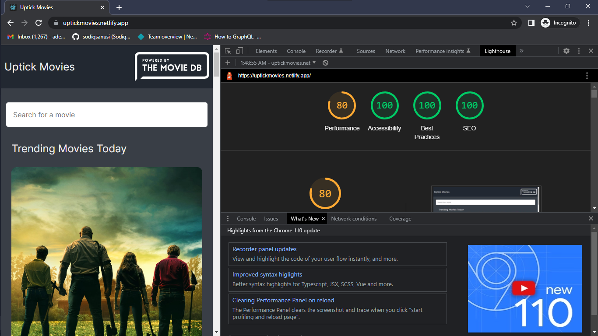

# Uptick Technical Assessment Solution (Frontend Track)

This is a solution to the [frontend technical assessment](./uptickAssessment.pdf) for the Uptick Fellowship.

## Table of contents

- [Overview](#overview)
  - [The challenge](#the-challenge)
  - [Screenshot](#screenshot)
  - [Links](#links)
- [My process](#my-process)
  - [Built with](#built-with)
  - [What I learned](#what-i-learned)
  - [Continued development](#continued-development)
  - [Useful resources](#useful-resources)
- [Author](#author)
- [Acknowledgments](#acknowledgments)

## Overview

This was, well, impromptu. Saw the mail for the assessment late, had to panic-build at a point but anyways that's that. The goal was to build a web application that had the requirements specified in the prompt document. I also had to think of how the interface would look like, which honestly isn't my strong forte (design isn't easy fr😪), thankfully there were a lot of apps/interfaces I took inspiration from while building. Let me know if the app looks like sh**🙂.

### The challenge

Users should be able to:

- Search for and view information about movies
- Be able to filter the gotten search results by genre and release date
- View the optimal layout for the interface depending on their device's screen size
- See the results in a user-friendly format

> It was also necessary that I get the data for the movies from a public API (no hardcoded data!)

### Screenshot

### Links

- Solution URL: [https://github.com/sodiqsanusi/uptick-movie-app/](https://github.com/sodiqsanusi/uptick-movie-app/)
- Live Site URL: [https://uptickmovies.netlify.app/](https://uptickmovies.netlify.app/)

## My process

As usual, almost same workflow with slight differentiations:
1. Sketched out the HTML structure & a rough components overview of the site on paper.
2. Used the `create-react-app` command to get a boilerplate React application. (`npx` was giving me issues, had to use yarn. which wasn't bad btw)
3. Wrote the HTML/JSX for the top-level components that were important in the overall app.
4. Started styling for mobile/small screen devices *(had loads of problems with styling. Again, design is key to a good project)*.
5. Tweaked styles, then worked on functionalities *(the filter functionality took some time too😩)*.
6. Made the site responsive for large screen devices.
7. Used Lighthouse tool to check for possible improvements, then tweaked things using the gotten feedback.

### Built with

- Flexbox
- CSS Grid
- Mobile-first workflow
- CSS Modules
- [React](https://reactjs.org/) - Javascript library moonlighting as a framework👀
- [React-router-dom](https://reactrouter.com/) - Used for changing pages in the React virtual DOM

### What I learned

First of, it became obvious that even after panic, you just have to build at the end. Building this app was quite interesting because, well, I was on a restricted timeframe, had to attend classes, was thinking up on how the interface would look like and still getting feedback on how well the app was following the prompt.

Haven't built anything like that filter component, so I guess it was also a learning experience😅. Enjoyed building it out though.

### Continued development

More apps to build! Also planning to get more fullstacky, maybe learn a bit of Node & Express with some database management systems. Doesn't have to be deep sha, just surface-level knowledge.

### Useful resources

- [The Movie Database API](https://developers.themoviedb.org/3/getting-started/introduction/) - The public API I used in building the application, the docs were super helpful and self-explanatory.

## Author

- Twitter - [@sodiqsanusi_](https://www.twitter.com/sodiqsanusi_)

## Acknowledgments

Like I said earlier, saw the assessment email late, and panicked. Sarfo & Orin helped me calm down and actually do something lol, will really miss having these guys around. Ciao🤞🏾
